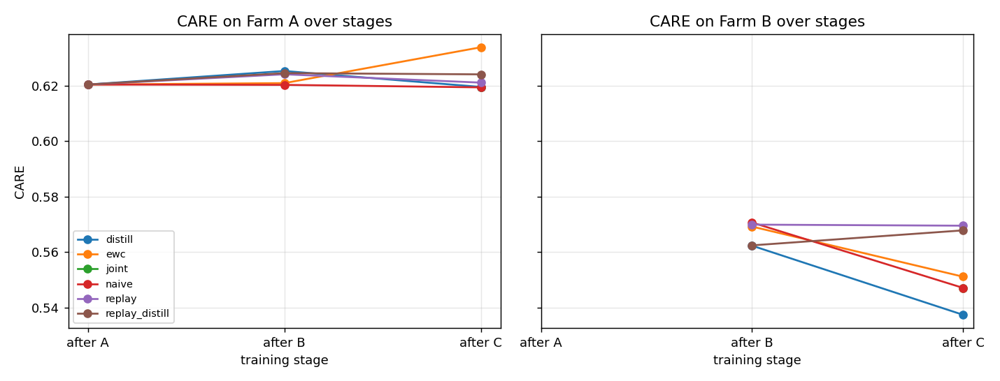
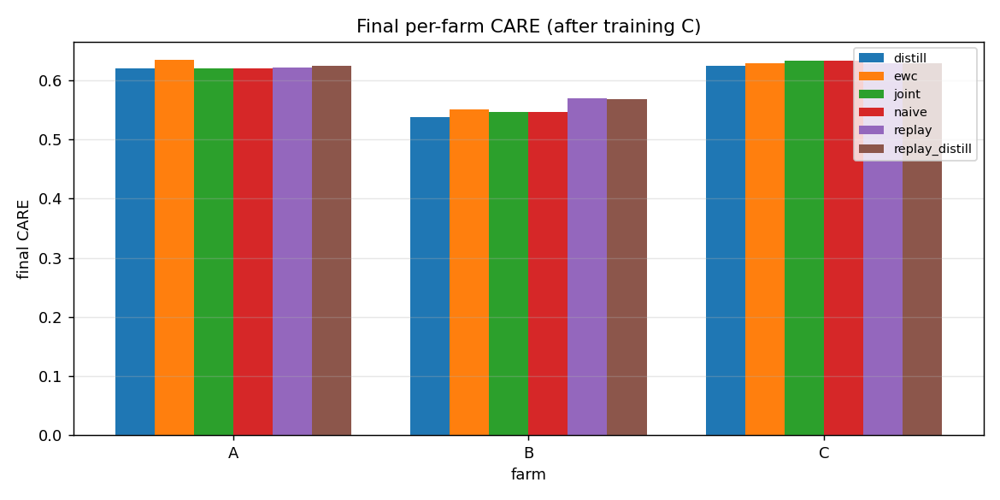

# CARE Continual-Learning — Results Summary

- **Align mode:** adapter  ·  **Bandit:** off  ·  **Seeds:** 3 ([0, 1, 2])  ·  **Sequence:** A → B → C
- CARE sub-scores: Coverage (F₀.₅), Earliness, Reliability, Accuracy; higher is better. Forgetting on Farm A = CARE(after A) − CARE(after C); **lower is better**, negative = backward transfer.

## 1. Final average CARE & forgetting (mean ± std over seeds)

| strategy | final_avg_care | forgetting (Farm A) | backward_transfer |  |
| --- | --- | --- | --- | --- |
| joint | 0.600 ± 0.005 | — | 0.000 ± 0.000 | upper bound |
| naive | 0.600 ± 0.005 | 0.001 ± 0.002 | -0.012 ± 0.006 | lower bound |
| ewc | 0.604 ± 0.008 | -0.013 ± 0.010 | -0.002 ± 0.009 |  |
| replay | 0.607 ± 0.002 | -0.001 ± 0.006 | 0.000 ± 0.004 |  |
| distill | 0.594 ± 0.004 | 0.001 ± 0.003 | -0.013 ± 0.006 |  |
| replay_distill | 0.607 ± 0.000 | -0.004 ± 0.001 | 0.005 ± 0.001 |  |

## 2. Final-stage sub-scores (after training C, mean over farms+seeds)

| strategy | coverage | earliness | reliability | accuracy | CARE |
| --- | --- | --- | --- | --- | --- |
| joint | 0.259 | 0.111 | 0.730 | 0.950 | 0.600 |
| naive | 0.259 | 0.111 | 0.730 | 0.950 | 0.600 |
| ewc | 0.280 | 0.119 | 0.738 | 0.943 | 0.604 |
| replay | 0.283 | 0.114 | 0.734 | 0.951 | 0.607 |
| distill | 0.254 | 0.105 | 0.717 | 0.947 | 0.594 |
| replay_distill | 0.286 | 0.117 | 0.732 | 0.950 | 0.607 |

## 3. Farm A CARE over training stages (the forgetting story)

| strategy | after A | after B | after C |
| --- | --- | --- | --- |
| joint | — | — | 0.619 |
| naive | 0.620 | 0.620 | 0.619 |
| ewc | 0.620 | 0.621 | 0.634 |
| replay | 0.620 | 0.624 | 0.621 |
| distill | 0.620 | 0.625 | 0.620 |
| replay_distill | 0.620 | 0.625 | 0.624 |

## 4. Findings

- ⚠️ Upper-bound check: ewc, replay, replay_distill exceeded `joint` on final_avg_care (within seed noise — flag, don't trust).
- Lowest forgetting on Farm A: **ewc** (-0.0135).
- `naive` forgetting = +0.0010 (expected lower bound).
- **ewc** cuts Farm-A forgetting by 0.0145 vs `naive`.
- Worst CL forgetting: naive (+0.0010).
- Best CL final_avg_care: replay_distill (0.607).
- Note: final_avg_care gaps are often within ~1 std; the robust signal is the **forgetting / backward-transfer** comparison.

## 5. Figures

